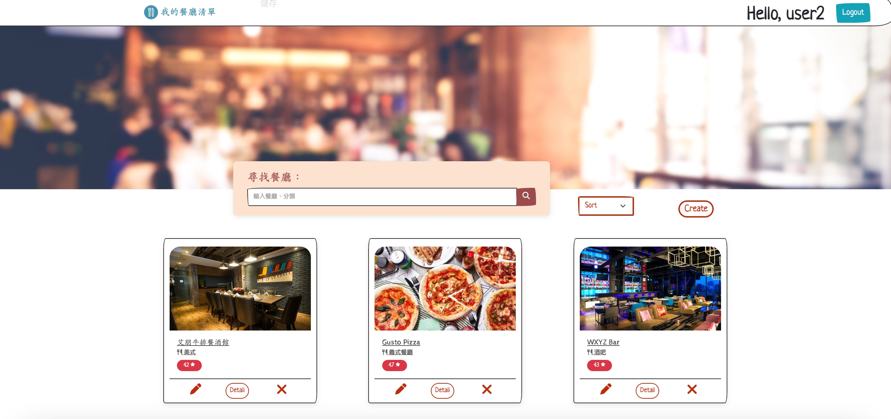
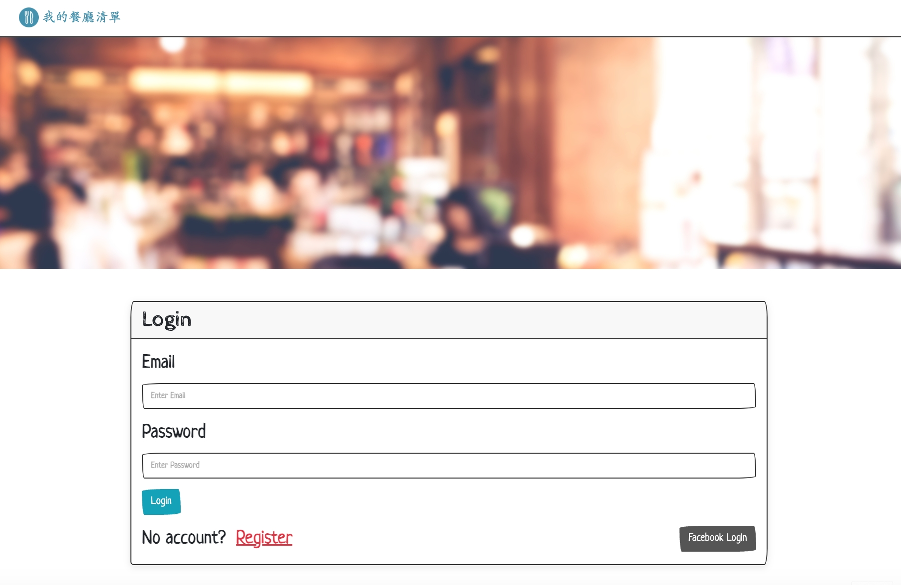
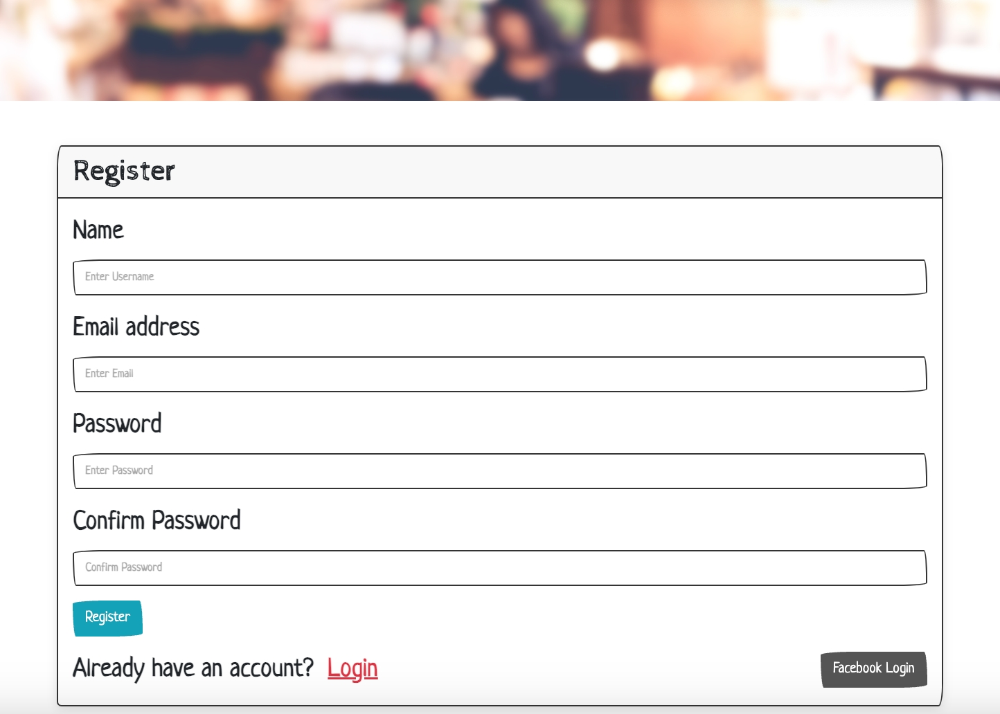

# My Restaurants List
This is a restaurant listing application that allows users to easily browse restaurant listings, search for specific restaurants, and view detailed restaurant information.
## Features
- Show all restaurants on the homepage.
- Using keyword to search for specific restaurants.
- View detailed restaurant's information.
- Link to Google Map :  
  On the restaurant details page, users can click on the restaurant's address, and the system will directly link to the restaurant's location on Google Maps.
- CRUD function.
- Users can register their own accounts
- Users can logout and login with their own account or facebook.

## Prerequisites
> **Node.js v18.15.0**

> **MySQL v8.0.37**
## Installation
1. Open your terminal and clone the repository :   
    ```sh
    git clone https://github.com/dodoschnau/AC_restaurants_list.git
    ```

2. Change directory :   
    ```sh
    cd AC_restaurants_list
    ```

3. Install the required npm packages :   
    ```sh
    npm install
    ```

4. Set up your environment variables :

    Create a `.env` file based on the `.env.example` file and fill in your own values:
    ```sh
    cp .env.example .env
    ```

5. Create the database in MySQL :
    ```sh
    CREATE DATABASE restaurant
    ```
    `Note: Make sure the MySQL server connection settings match those in config/config.json.`

6. Run the database migrations and seeders to set up the initial database structure and data :
    ```sh
    npx sequelize-cli db:migrate
    npm run seed
    ```

7. Launch the application :   
    ```sh
    npm run start
    ```
8. Open your browser and visit http://localhost:3000 to start using the program.


## Test account
The seed data provides the following two sets of accounts for use :
> Email：user1@example.com / Pwd：12345678

> Email：user2@example.com / Pwd：12345678

## Development

To run the application in development mod
e with `nodemon` and `cross-env`, use the following command:
```sh
npm run dev:dev
```

## Authentication
### Passport Local Strategy
    
  > Users can register and login with their own email and password.

### Passport Facebook OAuth 2.0
    
  > Users can login using their Facebook account.

  `Note` Make sure to set up your Facebook Developer account and configure the app with the necessary credentials in the `.env` file.


## Screenshot


