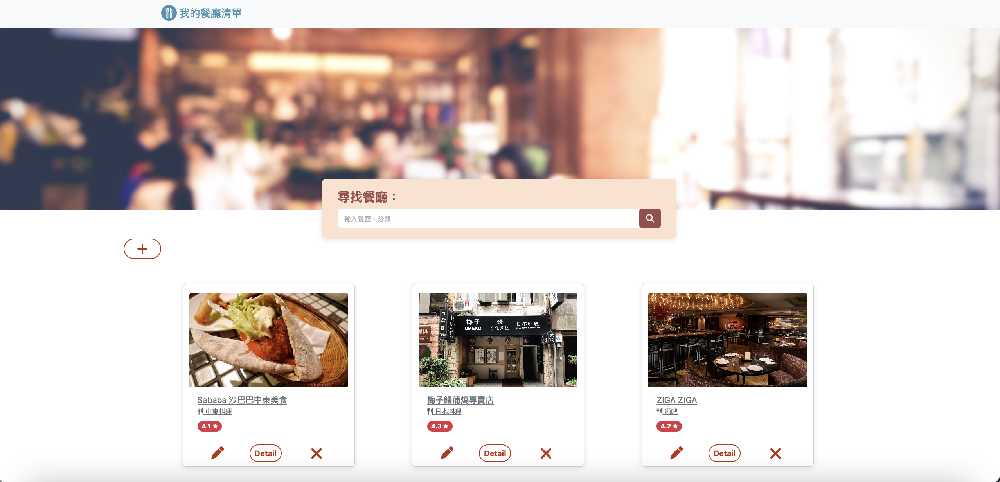

# My Restaurants List
This is a restaurant listing application that allows users to easily browse restaurant listings, search for specific restaurants, and view detailed restaurant information.
## Features
- Show all restaurants on the homepage.
- Using keyword to search for specific restaurants.
- View detailed restaurant's information.
- Link to Google Map :  
  On the restaurant details page, users can click on the restaurant's address, and the system will directly link to the restaurant's location on Google Maps.
- CRUD function.

## Prerequisites
> **Node.js v18.15.0**

> **MySQL v8.0.37**
## Installation
1. Open your terminal and clone the repository :   
    ```
    git clone https://github.com/dodoschnau/AC_restaurants_list.git
    ```
2. Change directory :   
    ```
    cd AC_restaurants_list
    ```
3. Install the required npm packages :   
    ```
    npm install
    ```

4. Run the database migrations and seeders to set up the initial database structure and data:
    ```
    npx sequelize-cli db:migrate
    npx sequelize-cli db:seed:all
    ```
5. Launch the application :   
    ```
    npm run start
    ```
6. Open your browser and visit http://localhost:3000 to start using the program.


## Screenshot
